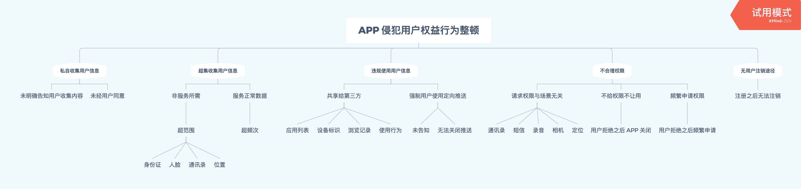

# 2019 年工信部最新 APP 权限整顿内容

主要有下面四大类：
- 私自收集用户信息
- 超集收集用户信息
- 违规使用用户信息
- 不合理权限
- 无用户注销途径

`欢迎大家举报流氓软件 APP`

# 概览

# 详细内容

首先是违规收集用户个人信息方面，主要包括两种情形：一是“私自收集个人信息”，即APP未明确告知收集使用个人信息的目的、方式和范围并获得用户同意前，收集用户个人信息。

二是“超范围收集个人信息”，即APP收集个人信息，非服务所必需或无合理应用场景，超范围或超频次收集个人信息，如通讯录、位置、身份证、人脸等。

违规使用用户个人信息方面的两种问题主要表现为，一是“私自共享给第三方”，即APP未经用户同意与其他应用共享、使用用户个人信息，如设备识别信息、商品浏览记录、搜索使用习惯、常用软件应用列表等。二是“强制用户使用定向推送功能”，即APP未向用户告知，或未以显著方式标示，将收集到的用户搜索、浏览记录、使用习惯等个人信息，用于定向推送或精准营销，且未提供关闭该功能的选项。

在不合理索取用户权限方面，主要有三个问题。一是“不给权限不让用”，即APP安装和运行时，向用户索取与当前服务场景无关的权限，用户拒绝授权后，应用退出或关闭。二是“频繁申请权限”，即APP在用户明确拒绝权限申请后，频繁申请开启通讯录、定位、短信、录音、相机等与当前服务场景无关的权限，骚扰用户。三是“过度索取权限”，即APP在用户未使用相关功能或服务时，提前申请开启通讯录、定位、短信、录音、相机等权限，或超出其业务功能或服务外，申请通讯录、定位、短信、录音、相机等权限。

在为用户账号注销设置障碍方面，问题主要表现在“账号注销难”，即APP未向用户提供账号注销服务，或为注销服务设置不合理的障碍。

# 如何认定 APP 有问题

参见 [APP 违法违规收集使用个人信息行为认定方法](./how-to-check.md)

# 相关报道

- [solidot](https://www.solidot.org/story?sid=62478)
- [新京报网](http://www.bjnews.com.cn/finance/2019/11/04/645316.html)
- [同盾非法爬虫](https://www.chainnews.com/articles/777152590876.htm)
- [权限问题 APP 点名列表](https://mp.weixin.qq.com/s/lwPtpaYfwB5dlEc7YffQnQ)
